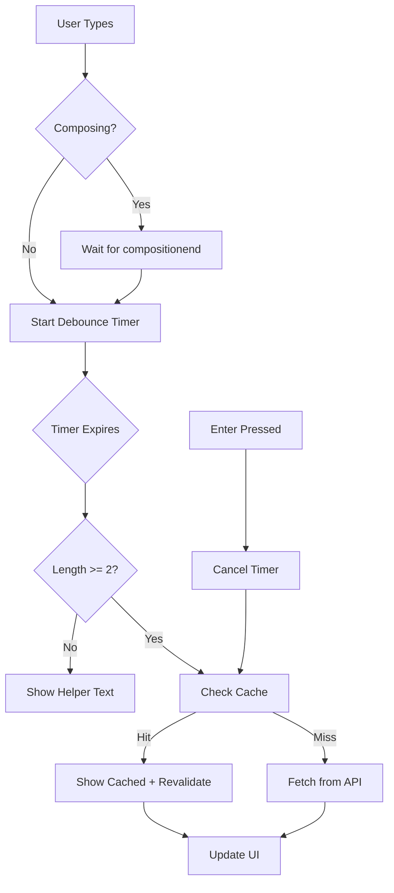

# Debounced Search Implementation

## Overview

This implementation adds debounced search functionality to the Exercise Library, preventing excessive database queries while maintaining a responsive user experience.

## Key Features

### 1. Debounced Timing
- **Desktop**: 350ms delay
- **Mobile** (iPhone/Android): 500ms delay
- **Enter key**: Immediate search (bypasses debounce)

### 2. Minimum Length Validation
- No queries until input has ≥ 2 characters
- Shows "Keep typing to search..." helper text below minimum
- **Exception**: Empty input (cleared search) immediately shows all results

### 3. Request Cancellation
- Uses `AbortController` to cancel in-flight requests
- Only the latest response updates the UI
- Prevents race conditions and stale data

### 4. Client-Side Caching
- LRU cache with 10 item capacity
- 5-minute TTL for cached results
- Instant display of cached results with background revalidation

### 5. Accessibility
- `role="searchbox"` on input
- `aria-label="Search exercises"` 
- `aria-live="polite"` on loading spinner
- `aria-describedby` linking to helper text

### 6. International Input Support
- Respects IME composition events
- Debounce starts after `compositionend`
- Handles `compositionstart`/`compositionend` properly

## Architecture

### Components

1. **`useDebouncedSearch` Hook** (`/hooks/useDebouncedSearch.ts`)
   - Core debouncing logic
   - LRU cache implementation
   - AbortController management
   - Mobile detection

2. **`DebouncedSearchInput` Component** (`/components/exercise/DebouncedSearchInput.tsx`)
   - Search input with debounced behavior
   - IME composition handling
   - Accessibility attributes
   - Loading states

3. **`ExerciseLibraryClient` Component** (`/components/exercise/ExerciseLibraryClient.tsx`)
   - Hybrid server/client rendering
   - Manages search results and pagination
   - URL synchronization

4. **API Route** (`/app/api/exercises/route.ts`)
   - Client-side API endpoint
   - Parameter validation
   - Error handling

### Data Flow



## Query Behavior

### URL Parameters
- `search`: Search term
- `type`: Exercise type filter
- `muscle`: Primary muscle group filter
- `movement`: Force type filter (Push/Pull/Static)
- `difficulty`: Level filter (Beginner/Intermediate/Expert)
- `page`: Page number (resets to 1 on new search)
- `limit`: Results per page (default: 15)

### API Endpoint
```
GET /api/exercises?search=<query>&page=1&limit=15&<filters>
```

## UX States

1. **Idle**: No search active, no spinner
2. **Debouncing**: User typing, no spinner yet
3. **Loading**: Request in flight, shows inline spinner
4. **Success**: Results displayed
5. **Error**: Non-blocking error message
6. **Empty**: Helper text or empty state

## Performance Benefits

### Before
- Query fired on every keystroke
- Database hammered with rapid requests
- Potential for race conditions
- No caching, repeated identical queries

### After
- Single query after user pauses typing
- Intelligent caching reduces duplicate requests
- Race condition protection via AbortController
- Responsive feel with instant cached results

## Testing

### Unit Tests (`__tests__/useDebouncedSearch.test.ts`)
- Debounce timing verification
- Mobile vs desktop delay
- Minimum length validation
- Request cancellation
- Cache hit/miss behavior
- Enter key bypass

### Integration Testing Checklist
- [ ] Fast typing results in single network call
- [ ] Backspace editing updates results after pause
- [ ] **Clear input immediately shows all results (no Enter required)**
- [ ] Filter changes apply debounce and reset page
- [ ] Navigation preserves state and cancels requests
- [ ] IME composition doesn't trigger premature searches

## Browser Support

- **Modern browsers**: Full functionality
- **IME support**: Chrome, Firefox, Safari, Edge
- **Mobile**: iOS Safari, Chrome Mobile, Samsung Internet
- **Fallback**: Graceful degradation to immediate search

## Configuration

```typescript
const searchConfig = {
  delayDesktop: 350,    // Desktop debounce delay (ms)
  delayMobile: 500,     // Mobile debounce delay (ms)
  minLength: 2,         // Minimum search length
  cacheSize: 10,        // LRU cache capacity
  cacheTTL: 5 * 60 * 1000  // Cache TTL (5 minutes)
};
```

## Monitoring

### Metrics to Track
- Search query frequency
- Cache hit rate
- Average response time
- Error rates
- User engagement (searches per session)

### Performance Indicators
- Reduced database load
- Improved perceived performance
- Lower bandwidth usage
- Fewer failed requests due to race conditions
