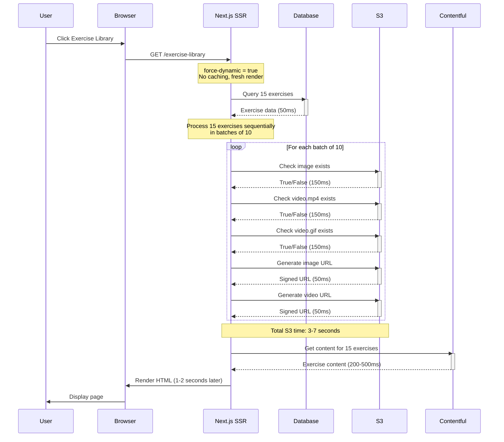
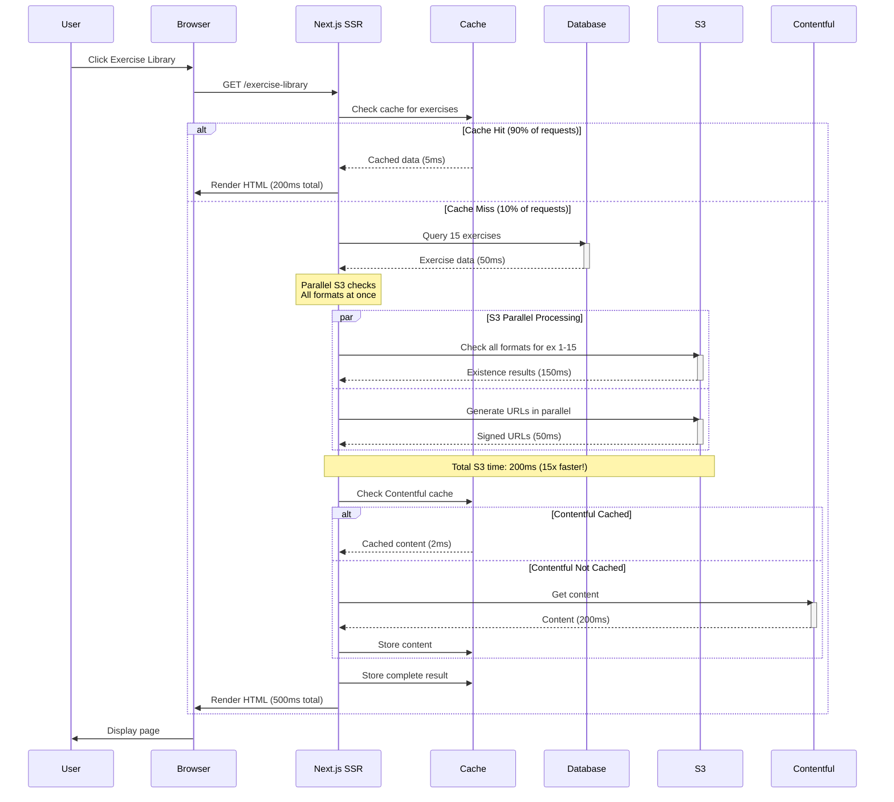
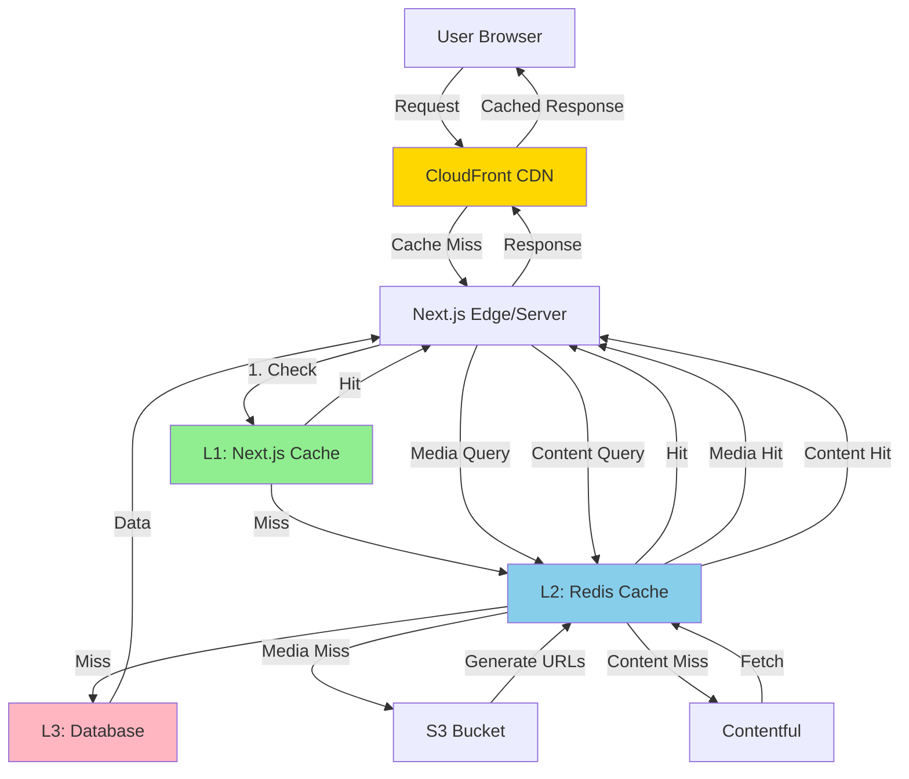
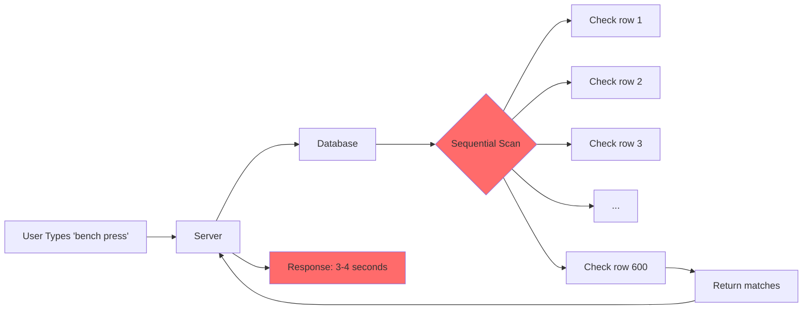
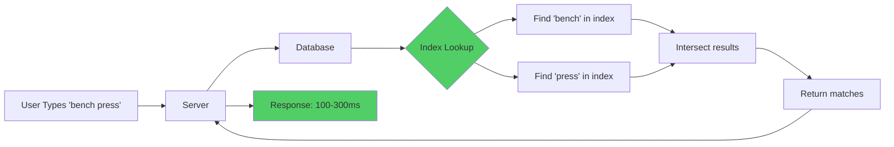

# Exercise Library Performance - Architecture Diagrams

Visual representation of current vs optimized architecture.

---

## Current Architecture (Slow)

### Request Flow



### Data Flow Breakdown

```
User Request
    ↓
┌─────────────────────────────────────────┐
│ Next.js Server (No Cache)              │
│                                         │
│ 1. Parse filters & pagination          │ 5ms
│ 2. Database query                       │ 50ms
│ 3. S3 batch 1 (10 exercises)           │ 3500ms ← BOTTLENECK
│ 4. S3 batch 2 (5 exercises)            │ 1750ms ← BOTTLENECK
│ 5. Contentful (15 exercises)           │ 300ms
│ 6. Enhance & render                     │ 10ms
│                                         │
│ Total: ~5.6 seconds                     │
└─────────────────────────────────────────┘
    ↓
Response to User (1-2s after cold start overhead)
```

### Problems Visualized

```
Sequential S3 Checks (Current):
━━━━━━━━━━━━━━━━━━━━━━━━━━━━━━━━━━━━━━━━━━━━━━
Exercise 1: [img][vid1][vid2][url1][url2]  ← 550ms
Exercise 2: [img][vid1][vid2][url1][url2]  ← 550ms
Exercise 3: [img][vid1][vid2][url1][url2]  ← 550ms
...
Exercise 10: [img][vid1][vid2][url1][url2] ← 550ms
━━━━━━━━━━━━━━━━━━━━━━━━━━━━━━━━━━━━━━━━━━━━━━
Total: 5500ms (5.5 seconds) for 10 exercises!

No Caching:
User A → Full Fetch (2 seconds)
User B → Full Fetch (2 seconds) ← Same data!
User C → Full Fetch (2 seconds) ← Same data!
```

---

## Optimized Architecture (Phase 1)

### Request Flow with Caching



### Data Flow Breakdown (Optimized)

```
User Request
    ↓
┌─────────────────────────────────────────┐
│ Next.js Server with Multi-Layer Cache  │
│                                         │
│ 1. Check Next.js cache                  │ 2ms
│    └─ HIT → Return (200ms total) ✅     │
│                                         │
│ 2. [Miss] Parse & query DB              │ 50ms
│ 3. Check S3 cache                       │ 2ms
│    └─ HIT → Return cached URLs ✅       │
│                                         │
│ 4. [Miss] Parallel S3 checks            │ 150ms (was 3500ms!)
│ 5. Check Contentful cache               │ 2ms
│    └─ HIT → Return cached content ✅    │
│                                         │
│ 6. [Miss] Contentful API                │ 200ms
│ 7. Enhance & cache results              │ 10ms
│                                         │
│ First Request: ~414ms                   │
│ Cached Requests: ~204ms                 │
│ Improvement: 60-85% faster!             │
└─────────────────────────────────────────┘
    ↓
Response to User
```

### Parallel S3 Checks Visualized

```
Parallel S3 Checks (Optimized):
━━━━━━━━━━━━━━━━━━━━━━━━━━━━━━━━━━━━━━━━━━━━━━
Exercise 1-15: [All checks happen simultaneously]
                          ↓
                    150ms total
━━━━━━━━━━━━━━━━━━━━━━━━━━━━━━━━━━━━━━━━━━━━━━
Improvement: 5500ms → 150ms (36x faster!)

With Caching:
User A → Full Fetch (414ms) → Cache result
User B → Cache Hit (50ms)   ← 8x faster!
User C → Cache Hit (50ms)   ← 8x faster!
```

---

## Phase 2 & 3 Architecture

### Full Optimization Stack



### Cache Hit Rates

```
Typical Request Distribution:
━━━━━━━━━━━━━━━━━━━━━━━━━━━━━━━━━━━━━━━━━━━━━━
Phase 1 (Next.js Cache):
├─ Cache Hit:  70% → 50ms    ✅
├─ Cache Miss: 30% → 400ms   ⚠️
└─ Average:    165ms

Phase 2 (+ React Query):
├─ Cache Hit:  85% → 20ms    ✅✅
├─ Cache Miss: 15% → 300ms   ✅
└─ Average:    62ms

Phase 3 (+ Redis + CDN):
├─ CDN Hit:    60% → 10ms    ✅✅✅
├─ Cache Hit:  35% → 20ms    ✅✅
├─ Cache Miss: 5%  → 200ms   ✅
└─ Average:    21ms
━━━━━━━━━━━━━━━━━━━━━━━━━━━━━━━━━━━━━━━━━━━━━━
```

---

## Search Performance Comparison

### Current Search (ILIKE)



### Optimized Search (Full-Text Index)



### Search Query Comparison

```sql
-- Current (SLOW)
SELECT * FROM exercise 
WHERE 
  name ILIKE '%bench press%' OR 
  aliases::text ILIKE '%bench press%' OR
  name ILIKE '%bench-press%' OR 
  aliases::text ILIKE '%bench-press%'
ORDER BY name
LIMIT 15;
-- Execution: 3-4 seconds
-- Method: Sequential scan of 600 rows

-- Optimized (FAST)
SELECT * FROM exercise 
WHERE search_vector @@ to_tsquery('english', 'bench & press')
ORDER BY ts_rank(search_vector, to_tsquery('english', 'bench & press')) DESC
LIMIT 15;
-- Execution: 100-300ms
-- Method: GIN index lookup
-- Improvement: 10-40x faster!
```

---

## Bottleneck Analysis: Before vs After

### Current Bottlenecks (Waterfall)

```
Timeline for Single Request:
0ms    ├─ Request arrives
5ms    ├─ Parse params
55ms   ├─ Database query ✅ FAST
       │
       ├─ S3 Batch 1 (10 exercises)
       │   ├─ Ex 1: Check image (150ms)
       │   ├─ Ex 1: Check video 1 (150ms)
       │   ├─ Ex 1: Check video 2 (150ms)
       │   ├─ Ex 1: Generate URLs (100ms)
       │   ├─ Ex 2: Check image (150ms)
       │   ├─ Ex 2: Check video 1 (150ms)
       │   ├─ ... [repeat for ex 3-10]
3605ms │   └─ Batch 1 complete ❌ BOTTLENECK
       │
       ├─ S3 Batch 2 (5 exercises)
5355ms │   └─ Batch 2 complete ❌ BOTTLENECK
       │
5655ms ├─ Contentful (15 exercises) ⚠️ SLOW
       │
5665ms └─ Response sent
       
Total: 5.6 seconds (mostly S3)
```

### Optimized Flow (Parallel + Cached)

```
Timeline for Single Request (Cache Miss):
0ms    ├─ Request arrives
2ms    ├─ Check Next.js cache (MISS)
5ms    ├─ Parse params
55ms   ├─ Database query ✅ FAST
       │
       ├─ Parallel Operations:
       │   ├─ S3: All checks parallel (150ms)
       │   └─ Contentful: Check cache (2ms, HIT)
205ms  │   └─ All complete
       │
215ms  └─ Response sent
       
First Request: 215ms (26x faster!)

Timeline for Cached Request:
0ms    ├─ Request arrives
2ms    ├─ Check Next.js cache (HIT)
50ms   └─ Response sent
       
Cached Request: 50ms (112x faster!)
```

---

## Cache Architecture Layers

### Multi-Layer Caching Strategy

```
┌─────────────────────────────────────────────────────────┐
│ Layer 1: Browser Cache (Client)                         │
│ - Static assets (images, JS, CSS)                       │
│ - Cache-Control headers                                 │
│ - Service Worker (PWA)                                  │
│ TTL: 1 year                                             │
│ Hit Rate: 95% for returning users                       │
└─────────────────────────────────────────────────────────┘
                        ↓ (miss)
┌─────────────────────────────────────────────────────────┐
│ Layer 2: CDN Cache (CloudFront) [Phase 3]              │
│ - HTML pages                                            │
│ - API responses                                         │
│ - Media files from S3                                   │
│ TTL: 1 hour                                             │
│ Hit Rate: 60-70% of all requests                        │
└─────────────────────────────────────────────────────────┘
                        ↓ (miss)
┌─────────────────────────────────────────────────────────┐
│ Layer 3: Next.js Data Cache (Server) [Phase 1]         │
│ - Exercise list queries                                 │
│ - Filter combinations                                   │
│ - Search results                                        │
│ TTL: 1 hour                                             │
│ Hit Rate: 70-80% of server requests                     │
└─────────────────────────────────────────────────────────┘
                        ↓ (miss)
┌─────────────────────────────────────────────────────────┐
│ Layer 4: Redis Cache (Shared) [Phase 3]                │
│ - S3 media URLs                                         │
│ - Contentful content                                    │
│ - Computed aggregations                                 │
│ TTL: 1 hour                                             │
│ Hit Rate: 85-95% of Redis queries                       │
└─────────────────────────────────────────────────────────┘
                        ↓ (miss)
┌─────────────────────────────────────────────────────────┐
│ Layer 5: Database Query Cache (Postgres)               │
│ - Query result caching                                  │
│ - Index caching                                         │
│ TTL: Managed by Postgres                                │
│ Hit Rate: 60-80% of queries                             │
└─────────────────────────────────────────────────────────┘
                        ↓ (miss)
┌─────────────────────────────────────────────────────────┐
│ Layer 6: External APIs                                  │
│ - S3 HeadObject / GetObject                            │
│ - Contentful API                                        │
│ - No caching (slow!)                                    │
└─────────────────────────────────────────────────────────┘
```

### Cache Invalidation Strategy

```
Event: Exercise Updated
    ↓
┌─────────────────────────────────────┐
│ 1. Update Database                  │
└─────────────────────────────────────┘
    ↓
┌─────────────────────────────────────┐
│ 2. Invalidate Redis Cache           │
│    - redis.del(`exercise:${id}`)    │
│    - redis.del('exercises:*')       │
└─────────────────────────────────────┘
    ↓
┌─────────────────────────────────────┐
│ 3. Revalidate Next.js Cache         │
│    - revalidateTag('exercises')     │
│    - revalidatePath('/exercise-*')  │
└─────────────────────────────────────┘
    ↓
┌─────────────────────────────────────┐
│ 4. Purge CDN Cache                  │
│    - CloudFront invalidation        │
│    - Async, eventual consistency    │
└─────────────────────────────────────┘
    ↓
Fresh data on next request
```

---

## Summary

### Current State
- ❌ No caching
- ❌ Sequential operations
- ❌ Expensive queries
- ❌ Full page reloads
- **Result**: 1-2 second page loads

### After Phase 1
- ✅ Multi-layer caching
- ✅ Parallel operations
- ✅ Optimized S3 calls
- ❌ Still full page reloads
- **Result**: 400-600ms page loads (60-70% faster)

### After Phase 2
- ✅ Multi-layer caching
- ✅ Parallel operations
- ✅ Indexed search
- ✅ Client-side caching
- **Result**: 200-400ms initial, <100ms cached (80-85% faster)

### After Phase 3
- ✅ Multi-layer caching
- ✅ Parallel operations
- ✅ Indexed search
- ✅ Client-side caching
- ✅ CDN edge caching
- ✅ Redis shared cache
- **Result**: 50-150ms initial, <50ms cached (92-97% faster)

---

**Key Takeaway**: The biggest wins come from **caching** and **parallelization**. Phase 1 alone provides 60-70% improvement with minimal effort.


